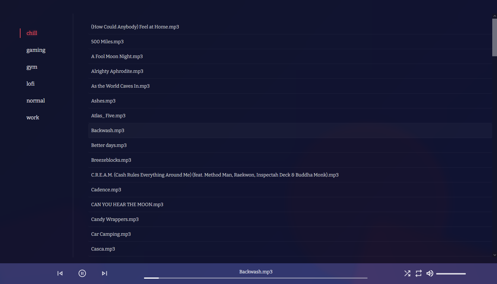

### music player

a simple/very lightweight web based music player, personal instance hosted @ [music.ellas.studio](https://music.ellas.studio)

##

### setup

1. Add your music to the playlists folder. Any folder in `./playlists` will be treated as a playlist, any file in a playlist will be treated as a song.
2. Run `node songSetup.js` to load playlists/songs stored in `./playlists`, or add them manually to `songMap.js` in a json format.
3. Open `index.html` in a web browser, or host all files on a web server
  - I used a GitHub Repository + Cloudflare Pages to host my instance for free
4. Enjoy!

If you want to edit the TypeScript, run `yarn install` to install the TypeScript compiler. After any such changes, run `tsc` to build.

##

### known issues

- Switching playlists loses current song highlighting
- `songSetup.js` doesn't handle incorrect file types/file layouts well

##

### preview

